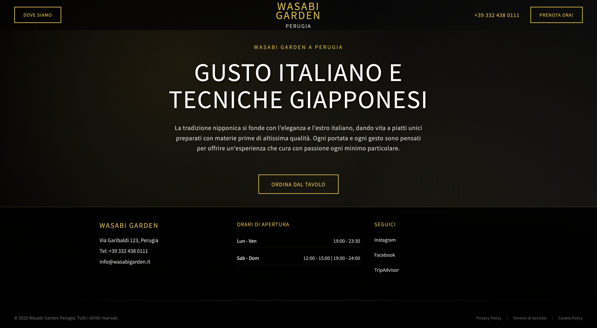
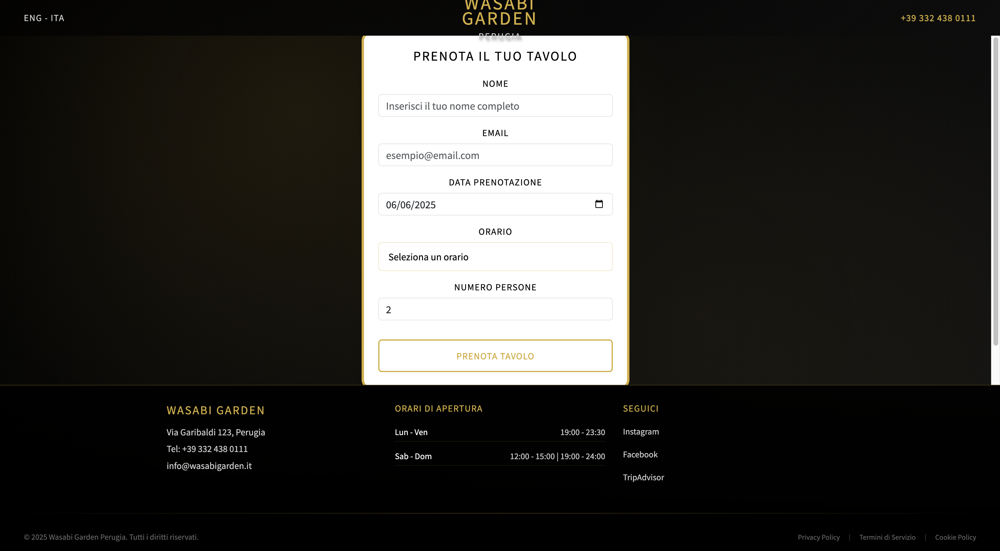
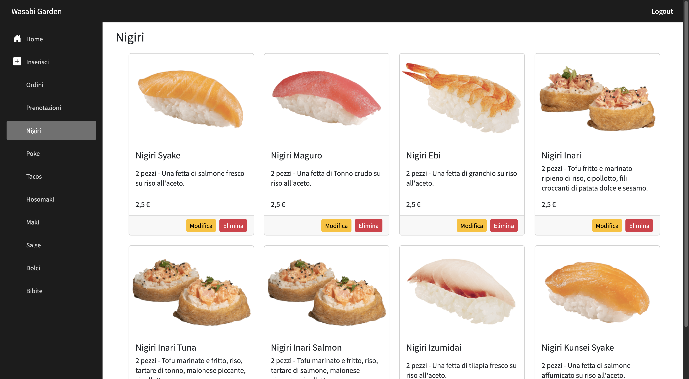
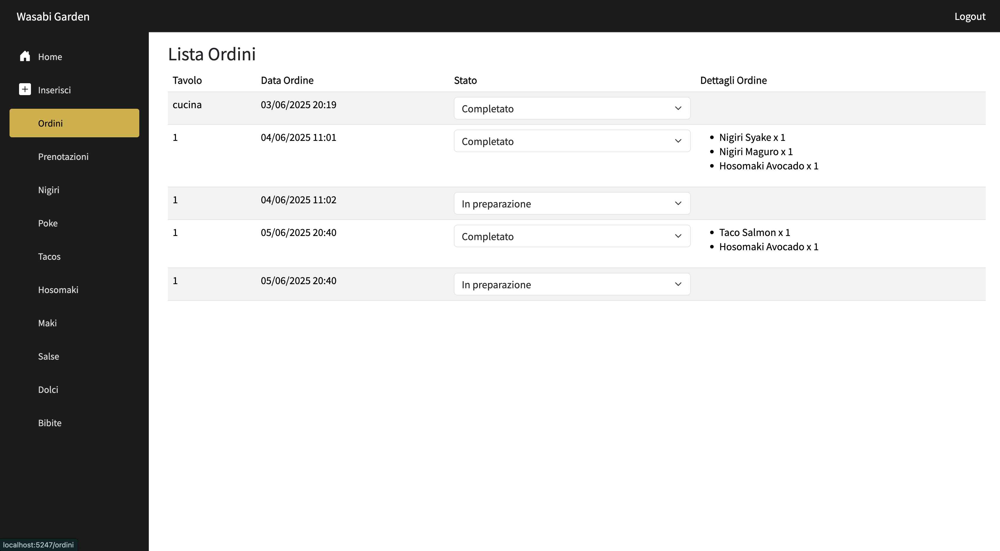

# 🍣 WasabiGardern - Blazor Server Web App for a Sushi Restaurant

WasabiGardern is a Blazor Server web application designed for managing the online presence and orders of a sushi restaurant.  
It features a dynamic menu, reservation system, and basic admin panel.

---

## 🚀 Features

- 🛒 Interactive sushi menu with categories
- 📅 Table reservation system
- 🔐 Basic admin panel (login-protected)
- 🌐 Server-side rendering with Blazor Server

---

## 🛠️ Built With

- [Blazor Server](https://dotnet.microsoft.com/en-us/apps/aspnet/web-apps/blazor)
- C# and .NET 8
- Razor Components
- Entity Framework Core
- Bootstrap 5

---

## ▶️ Getting Started

To run the project locally:

1. **Clone the repository**
   ```bash
   git clone https://github.com/tuo-username/SushiApp.git
   cd SushiApp

2. **Run**
   ```bash
   dotnet run

---

## 📸 Screenshot





---

## 🧑‍💻 Author

Created by Luishasleft
- 📧 luigigorgone4@gmail.com
- 🌐 github.com/luishasleft


